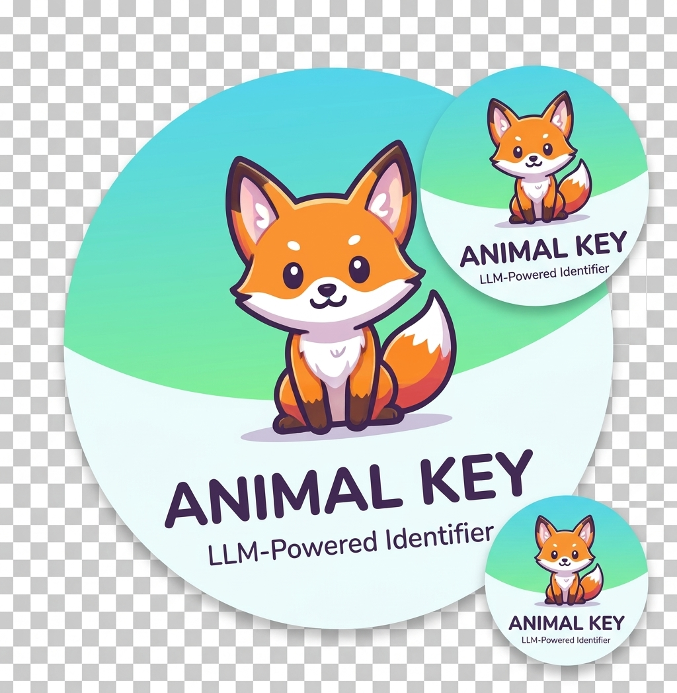

# LLMHub

<p align="center">
  
</p>

<p align="center">
  <strong>Local macOS Desktop Application for Managing LLM API Keys</strong>
</p>

<p align="center">
  
  
  
  
</p>

---

## Overview

LLMHub is a secure, local-first desktop application for managing LLM (Large Language Model) API keys, configurations, and generating code examples. All data is stored locally with AES-256-GCM encryption.

## Features

- **Secure Storage** - API keys encrypted with AES-256-GCM using macOS Keychain (safeStorage)
- **Multi-Profile Support** - Organize API keys by project or environment
- **Multi-Provider** - Support for OpenAI, Anthropic, Google AI, Azure, Ollama, LM Studio, OpenRouter, and custom providers
- **Multiple API Keys** - Store multiple API keys per provider with labels
- **Code Generation** - Generate ready-to-use code snippets in Python, cURL, JavaScript
- **Model Catalog** - Track models with pricing information (input/output cost per 1M tokens)
- **Export to .env** - Export all keys as environment variables
- **Dark/Light Theme** - System-aware theme switching
- **Local CLI Detection** - Detect installed CLI tools (Claude, Codex, Gemini)

## Screenshots

| Light Mode | Dark Mode |
|------------|-----------|
|  |  |

## Requirements

### System Requirements

- **macOS** 11.0 (Big Sur) or later
- **Node.js** 18.x or later
- **npm** 9.x or later

### Development Dependencies

| Package | Version | Purpose |
|---------|---------|---------|
| electron | ^31.0.0 | Desktop app framework |
| react | ^18.3.1 | UI library |
| react-dom | ^18.3.1 | React DOM renderer |
| typescript | ^5.4.5 | Type safety |
| vite | ^5.3.1 | Build tool |
| vite-plugin-electron | ^0.28.7 | Electron integration |
| tailwindcss | ^3.4.4 | CSS framework |
| zustand | ^4.5.2 | State management |
| electron-builder | ^24.13.3 | App packaging |

## Installation

### Clone the Repository

```bash
git clone https://github.com/yourusername/llmhub.git
cd llmhub
```

### Install Dependencies

```bash
npm install
```

### Run in Development Mode

```bash
npm run dev
```

The app will open automatically with hot-reload enabled.

## Usage

### 1. Create a Profile

Profiles help organize API keys by project or environment (e.g., "Production", "Development").

1. Click the **+** button in the sidebar under "Profiles"
2. Enter a profile name
3. Click **Add**

### 2. Add a Provider

1. Navigate to the **Providers** tab
2. Click **+ Add** button
3. Select provider type (OpenAI, Anthropic, Google AI, etc.)
4. Configure API base URL if needed
5. Click **Add Provider**

### 3. Add API Keys

1. Select a provider from the list
2. In the API Keys section, enter your key
3. Optionally add a label (e.g., "Production Key")
4. Click **Add Key**
5. Add more keys as needed

### 4. Generate Code

1. Navigate to the **Code** tab
2. Select a provider and model
3. Choose language (Python, cURL, JavaScript, Streaming)
4. Copy the generated code

### 5. Export to .env

1. Navigate to the **General** tab
2. Click **Export .env**
3. The file will contain all your API keys as environment variables

## Project Structure

```
llmhub/
├── electron/
│   ├── main.ts          # Electron main process
│   └── preload.ts       # Preload script (IPC bridge)
├── src/
│   ├── components/
│   │   ├── Sidebar.tsx      # Profile list, navigation
│   │   ├── Tabs.tsx         # Tab navigation
│   │   ├── ThemeToggle.tsx  # Dark/light switch
│   │   └── Notification.tsx # Toast notifications
│   ├── pages/
│   │   ├── General.tsx      # Overview, export
│   │   ├── Providers.tsx    # Provider & API key management
│   │   ├── Models.tsx       # Model catalog
│   │   ├── Code.tsx         # Code generator
│   │   └── About.tsx        # App info
│   ├── store/
│   │   └── useStore.ts      # Zustand state management
│   ├── lib/
│   │   └── codegen.ts       # Code generation templates
│   ├── types/
│   │   └── index.ts         # TypeScript types
│   ├── App.tsx              # Root component
│   ├── main.tsx             # React entry point
│   └── index.css            # Global styles
├── public/
│   └── logo.png             # App icon
├── docs/
│   └── architecture-diagram.html
├── package.json
├── tsconfig.json
├── vite.config.ts
├── tailwind.config.js
└── postcss.config.js
```

## Build & Distribution

### Build for Production

```bash
npm run build
```

This will:
1. Compile TypeScript
2. Bundle with Vite
3. Package with electron-builder

### Output

Built artifacts are placed in the `release/` directory:
- `LLMHub-1.0.1.dmg` - macOS installer
- `LLMHub-1.0.1-mac.zip` - Portable ZIP

### Code Signing (Optional)

For distribution outside the Mac App Store, set these environment variables:

```bash
export CSC_LINK=/path/to/certificate.p12
export CSC_KEY_PASSWORD=your_password
export APPLE_ID=your@email.com
export APPLE_APP_SPECIFIC_PASSWORD=xxxx-xxxx-xxxx-xxxx
```

## Data Storage

All data is stored locally in:

```
~/Library/Application Support/llmhub/llmhub-data.json
```

### Data Structure

```json
{
  "profiles": [...],
  "providers": [...],
  "models": [...],
  "api_keys": [...],
  "nextIds": { ... }
}
```

### Encryption

API keys are encrypted using:
- **Primary**: macOS `safeStorage` (Keychain-backed)
- **Fallback**: AES-256-GCM with derived key

## Environment Variables

No environment variables are required for basic usage. For development:

| Variable | Description |
|----------|-------------|
| `VITE_DEV_SERVER_URL` | Auto-set by Vite during development |

## Scripts

| Command | Description |
|---------|-------------|
| `npm run dev` | Start development server with hot-reload |
| `npm run build` | Build for production |
| `npm run preview` | Preview production build |
| `npm run typecheck` | Run TypeScript type checking |

## Supported Providers

| Provider | Default API URL | Models |
|----------|-----------------|--------|
| OpenAI | api.openai.com/v1 | GPT-4o, GPT-4o-mini, GPT-4-turbo, GPT-3.5-turbo |
| Anthropic | api.anthropic.com | Claude Sonnet 4, Claude 3.5 Sonnet/Haiku, Claude 3 Opus |
| Google AI | generativelanguage.googleapis.com | Gemini 2.0 Flash, Gemini 1.5 Pro/Flash |
| Azure OpenAI | {resource}.openai.azure.com | GPT-4o, GPT-4 |
| Ollama | localhost:11434 | Llama 3.2, Mistral, Code Llama |
| LM Studio | localhost:1234/v1 | Local models |
| OpenRouter | openrouter.ai/api/v1 | Multi-provider routing |
| Custom | User-defined | User-defined |

## Troubleshooting

### App won't start

```bash
# Clear Electron cache
rm -rf ~/Library/Application\ Support/llmhub
rm -rf node_modules
npm install
npm run dev
```

### API key not saving

Ensure macOS Keychain access is enabled for the app.

### Build fails

```bash
# Ensure Xcode CLI tools are installed
xcode-select --install
```

## Security Considerations

- All API keys are encrypted at rest
- No data is sent to external servers
- Keys are only decrypted when needed
- Uses macOS Keychain when available

## Contributing

1. Fork the repository
2. Create a feature branch (`git checkout -b feature/amazing-feature`)
3. Commit changes (`git commit -m 'Add amazing feature'`)
4. Push to branch (`git push origin feature/amazing-feature`)
5. Open a Pull Request

## License

MIT License - see [LICENSE](LICENSE) file for details.

## Changelog

### v1.0.1
- Added multiple API keys per provider
- Added dark/light theme toggle
- Added success notifications
- Fixed macOS traffic light overlap
- Added custom app icon
- Improved font sizes

### v1.0.0
- Initial release
- Profile management
- Provider CRUD
- Model catalog with pricing
- Code generation (Python, cURL, JS)
- Export to .env
- AES-256-GCM encryption

---

<p align="center">
  Built with Electron + React + TypeScript
</p>
